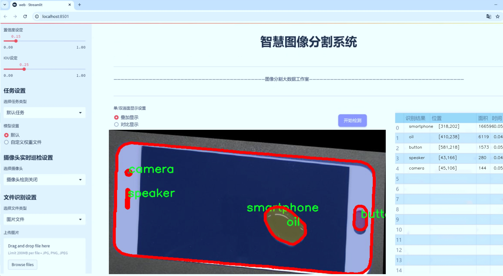
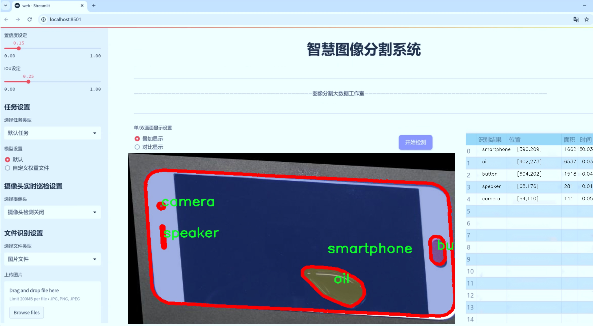
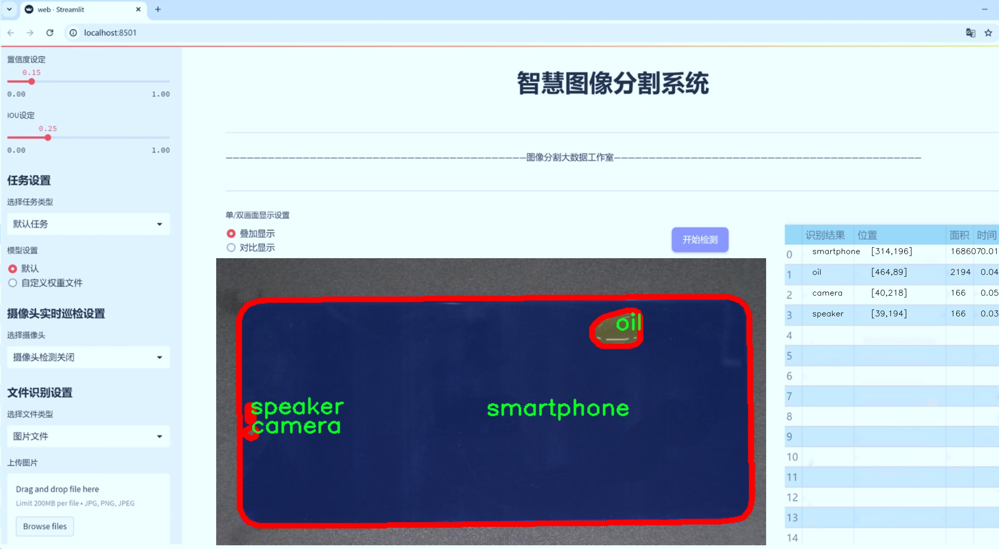
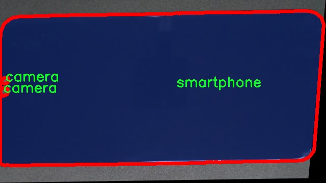
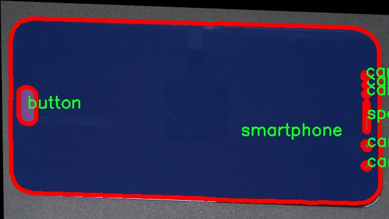
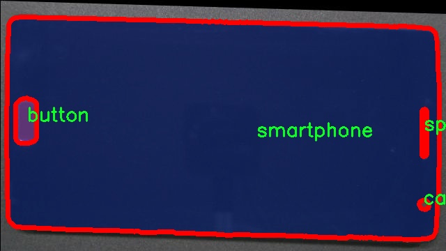
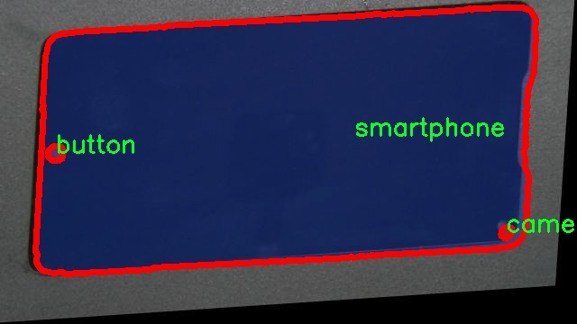
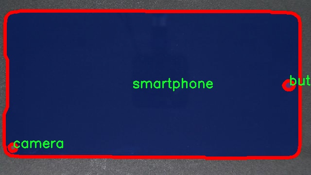

# 手机贴膜气泡识别组件定位图像分割系统源码＆数据集分享
 [yolov8-seg-C2f-Parc＆yolov8-seg-KernelWarehouse等50+全套改进创新点发刊_一键训练教程_Web前端展示]

### 1.研究背景与意义

项目参考[ILSVRC ImageNet Large Scale Visual Recognition Challenge](https://gitee.com/YOLOv8_YOLOv11_Segmentation_Studio/projects)

项目来源[AAAI Global Al lnnovation Contest](https://kdocs.cn/l/cszuIiCKVNis)

研究背景与意义

随着智能手机的普及，手机贴膜已成为保护手机屏幕的重要手段。然而，在贴膜过程中，气泡的产生不仅影响了贴膜的美观性，还可能影响触控体验和屏幕的使用寿命。因此，开发一种高效的气泡识别与定位系统，能够实时检测并标记出贴膜过程中产生的气泡，具有重要的实际应用价值和研究意义。

近年来，计算机视觉和深度学习技术的迅猛发展为图像分割和目标检测提供了新的解决方案。YOLO（You Only Look Once）系列模型以其快速的检测速度和高精度的性能，广泛应用于实时目标检测任务。YOLOv8作为该系列的最新版本，进一步提升了模型的检测精度和速度，尤其在复杂背景下的目标识别能力。基于YOLOv8的手机贴膜气泡识别组件定位图像分割系统，能够有效识别和定位气泡，进而为用户提供更好的贴膜体验。

本研究所使用的数据集“SmartPhone_Segmentation”包含1200张图像，涵盖了七个类别，包括按钮、相机、油污、划痕、智能手机、扬声器和污渍。这些类别的多样性为模型的训练提供了丰富的样本，有助于提高气泡识别的准确性。通过对这些图像进行实例分割，模型不仅能够识别气泡的存在，还能够精确地定位其在屏幕上的位置，为后续的处理和优化提供数据支持。

在实际应用中，气泡的存在可能与多种因素相关，如贴膜材料的质量、贴膜技术的熟练程度等。因此，开发一个能够实时监测和识别气泡的系统，不仅能够帮助用户及时发现问题，还能够为贴膜行业提供数据支持，促进行业标准的建立与完善。此外，该系统的研究与开发还可以为其他领域的图像分割与目标检测提供借鉴，如汽车维修、电子产品检测等，具有广泛的应用前景。

综上所述，基于改进YOLOv8的手机贴膜气泡识别组件定位图像分割系统的研究，不仅填补了现有技术在手机贴膜领域的空白，还为相关行业提供了新的解决方案。通过对气泡的精准识别与定位，能够有效提升用户的贴膜体验，推动手机贴膜行业的技术进步与发展。同时，该研究也为计算机视觉领域的应用提供了新的思路和方法，具有重要的学术价值和实际意义。

### 2.图片演示







##### 注意：由于此博客编辑较早，上面“2.图片演示”和“3.视频演示”展示的系统图片或者视频可能为老版本，新版本在老版本的基础上升级如下：（实际效果以升级的新版本为准）

  （1）适配了YOLOV8的“目标检测”模型和“实例分割”模型，通过加载相应的权重（.pt）文件即可自适应加载模型。

  （2）支持“图片识别”、“视频识别”、“摄像头实时识别”三种识别模式。

  （3）支持“图片识别”、“视频识别”、“摄像头实时识别”三种识别结果保存导出，解决手动导出（容易卡顿出现爆内存）存在的问题，识别完自动保存结果并导出到tempDir中。

  （4）支持Web前端系统中的标题、背景图等自定义修改，后面提供修改教程。

  另外本项目提供训练的数据集和训练教程,暂不提供权重文件（best.pt）,需要您按照教程进行训练后实现图片演示和Web前端界面演示的效果。

### 3.视频演示

[3.1 视频演示](https://www.bilibili.com/video/BV1khSQY7EQX/)

### 4.数据集信息展示

##### 4.1 本项目数据集详细数据（类别数＆类别名）

nc: 7
names: ['button', 'camera', 'oil', 'scratch', 'smartphone', 'speaker', 'stain']


##### 4.2 本项目数据集信息介绍

数据集信息展示

在现代智能手机的制造与使用过程中，手机贴膜的质量直接影响到用户的使用体验与设备的外观。为了提升手机贴膜的质量检测，尤其是气泡的识别与定位，开发了一套基于YOLOv8-seg的图像分割系统。为此，我们构建了一个名为“SmartPhone_Segmentation”的数据集，旨在为该系统的训练提供丰富且多样化的样本。

“SmartPhone_Segmentation”数据集包含了七个类别，分别是：按钮（button）、相机（camera）、油渍（oil）、划痕（scratch）、智能手机（smartphone）、扬声器（speaker）和污渍（stain）。这些类别的选择不仅涵盖了手机表面可能出现的各种瑕疵和特征，还为模型提供了丰富的上下文信息，以便更好地进行气泡的识别与定位。

在数据集的构建过程中，我们特别注重样本的多样性与真实性。每个类别的样本均来自于真实的手机设备，涵盖了不同品牌、型号和使用状态的手机。这种多样性确保了模型在训练过程中能够学习到各种可能的场景与条件，从而提高其在实际应用中的泛化能力。例如，按钮类别的样本包括了不同形状和颜色的按钮，而相机类别则展示了不同位置和设计的摄像头。这种细致的分类使得模型能够在复杂的环境中更准确地识别和分割目标。

此外，数据集中还包含了大量的标注信息，每个样本的标注均经过专业人员的仔细审核，以确保其准确性和一致性。每个类别的标注不仅包括目标的边界框信息，还涵盖了更为精细的像素级分割信息。这种高质量的标注数据为YOLOv8-seg模型的训练提供了坚实的基础，使其能够在进行图像分割时实现更高的精度与效率。

在数据集的规模方面，“SmartPhone_Segmentation”数据集包含了数千张高分辨率的图像，确保了模型在训练时能够接触到丰富的特征和变化。这些图像不仅涵盖了不同的光照条件、拍摄角度和背景环境，还包括了不同程度的气泡、污渍和划痕等缺陷。这种多样化的样本设计使得模型能够在面对各种实际情况时，依然保持较高的识别准确率。

为了进一步提升模型的性能，我们还采用了数据增强技术，通过对原始图像进行旋转、缩放、翻转和颜色调整等操作，生成了更多的训练样本。这种数据增强策略不仅增加了数据集的丰富性，还有效地防止了模型的过拟合现象，使其在面对未知数据时表现得更加稳健。

综上所述，“SmartPhone_Segmentation”数据集为改进YOLOv8-seg的手机贴膜气泡识别组件定位图像分割系统提供了强有力的支持。通过丰富的类别、多样的样本和高质量的标注，该数据集不仅为模型的训练奠定了基础，也为后续的应用与研究提供了广阔的前景。











### 5.全套项目环境部署视频教程（零基础手把手教学）

[5.1 环境部署教程链接（零基础手把手教学）](https://www.bilibili.com/video/BV1jG4Ve4E9t/?vd_source=bc9aec86d164b67a7004b996143742dc)


[5.2 安装Python虚拟环境创建和依赖库安装视频教程链接（零基础手把手教学）](https://www.bilibili.com/video/BV1nA4VeYEze/?vd_source=bc9aec86d164b67a7004b996143742dc)

### 6.手把手YOLOV8-seg训练视频教程（零基础小白有手就能学会）

[6.1 手把手YOLOV8-seg训练视频教程（零基础小白有手就能学会）](https://www.bilibili.com/video/BV1cA4VeYETe/?vd_source=bc9aec86d164b67a7004b996143742dc)


按照上面的训练视频教程链接加载项目提供的数据集，运行train.py即可开始训练



     Epoch   gpu_mem       box       obj       cls    labels  img_size
     1/200     0G   0.01576   0.01955  0.007536        22      1280: 100%|██████████| 849/849 [14:42<00:00,  1.04s/it]
               Class     Images     Labels          P          R     mAP@.5 mAP@.5:.95: 100%|██████████| 213/213 [01:14<00:00,  2.87it/s]
                 all       3395      17314      0.994      0.957      0.0957      0.0843

     Epoch   gpu_mem       box       obj       cls    labels  img_size
     2/200     0G   0.01578   0.01923  0.007006        22      1280: 100%|██████████| 849/849 [14:44<00:00,  1.04s/it]
               Class     Images     Labels          P          R     mAP@.5 mAP@.5:.95: 100%|██████████| 213/213 [01:12<00:00,  2.95it/s]
                 all       3395      17314      0.996      0.956      0.0957      0.0845

     Epoch   gpu_mem       box       obj       cls    labels  img_size
     3/200     0G   0.01561    0.0191  0.006895        27      1280: 100%|██████████| 849/849 [10:56<00:00,  1.29it/s]
               Class     Images     Labels          P          R     mAP@.5 mAP@.5:.95: 100%|███████   | 187/213 [00:52<00:00,  4.04it/s]
                 all       3395      17314      0.996      0.957      0.0957      0.0845


### 7.50+种全套YOLOV8-seg创新点代码加载调参视频教程（一键加载写好的改进模型的配置文件）

[7.1 50+种全套YOLOV8-seg创新点代码加载调参视频教程（一键加载写好的改进模型的配置文件）](https://www.bilibili.com/video/BV1Hw4VePEXv/?vd_source=bc9aec86d164b67a7004b996143742dc)

### 8.YOLOV8-seg图像分割算法原理

原始YOLOv8-seg算法原理

YOLOv8-seg算法是由Glenn-Jocher提出的一种新型目标检测与分割算法，继承了YOLO系列算法的优良传统，并在此基础上进行了多项创新和改进。YOLOv8-seg不仅在目标检测方面表现出色，还扩展了对目标的精细分割能力，使其在复杂场景下的应用更加广泛。其原理可以从数据预处理、骨干网络结构、特征融合机制、解耦头设计、标签分配策略等多个方面进行深入探讨。

首先，YOLOv8-seg在数据预处理方面依然沿用了YOLOv5的策略，采用了多种数据增强技术以提高模型的鲁棒性和泛化能力。这些增强手段包括马赛克增强、混合增强、空间扰动和颜色扰动等。马赛克增强通过将多张图像拼接在一起，增加了训练样本的多样性，帮助模型更好地学习到不同场景下的特征；混合增强则通过将两张图像进行混合，进一步丰富了样本的多样性；空间扰动和颜色扰动则通过对图像进行随机变换，增强了模型对光照变化和物体位置变化的适应能力。这些预处理技术为YOLOv8-seg的训练奠定了坚实的基础，使得模型在面对真实世界中的复杂情况时，能够保持较高的检测和分割精度。

在骨干网络结构方面，YOLOv8-seg对YOLOv5的主干网络进行了优化，采用了C2f模块替代了原有的C3模块。C2f模块引入了更多的分支结构，增强了特征提取过程中的梯度流动，改善了深层网络中的梯度消失问题。这一设计不仅提升了模型的学习能力，还有效减少了计算复杂度，使得YOLOv8-seg在保持高精度的同时，具备了更好的实时性。此外，YOLOv8-seg依然采用了CSPDarknet作为主干网络的基础，结合了SPPF模块以提升特征提取的效率和准确性。

特征融合机制是YOLOv8-seg的另一大亮点。它依然采用了FPN-PAN结构，通过自下而上的特征融合，充分利用不同层次的特征信息。YOLOv8-seg在这一结构中，采用了C2f模块来替代C3模块，进一步提升了特征融合的效果。通过这种多尺度特征融合，YOLOv8-seg能够在不同的分辨率下进行目标检测和分割，确保了对小目标和大目标的准确识别。

在解耦头设计方面，YOLOv8-seg引入了解耦头的概念，将分类和定位任务分开处理。解耦头由两条并行的分支组成，分别负责提取类别特征和位置特征。这种设计使得模型在进行目标分类和定位时，可以更加专注于各自的任务，提高了模型的收敛速度和预测精度。YOLOv8-seg的解耦头不仅继承了YOLOX的设计思路，还在此基础上进行了优化，使得模型在复杂场景下的表现更加出色。

标签分配策略方面，YOLOv8-seg采用了TOOD策略，解决了正负样本匹配的多尺度分配问题。与以往的静态匹配策略不同，TOOD策略能够动态调整标签分配，确保每个样本都能得到合理的处理。这一策略的引入，使得YOLOv8-seg在处理多样化数据集时，能够更好地适应数据的分布特征，从而提升了模型的整体性能。

在损失函数的设计上，YOLOv8-seg使用了Varifocal Loss作为分类损失，并结合CIoU Loss和DFL Loss作为回归损失。这种损失函数的设计充分考虑了正负样本的不平衡性，通过对负样本的加权处理，降低了其对损失的影响，从而使得模型在训练过程中更加关注高质量的正样本。这一策略不仅提升了模型的训练效率，还显著提高了最终的检测和分割精度。

综上所述，YOLOv8-seg算法通过在数据预处理、骨干网络结构、特征融合机制、解耦头设计和标签分配策略等多个方面的创新，显著提升了目标检测与分割的性能。其灵活的结构设计和高效的训练策略，使得YOLOv8-seg在各种复杂场景下均能保持良好的表现，展现出广泛的应用潜力和研究价值。随着对YOLOv8-seg算法的深入研究，未来有望在智能监控、自动驾驶、机器人视觉等领域发挥更大的作用。


### 9.系统功能展示（检测对象为举例，实际内容以本项目数据集为准）

图9.1.系统支持检测结果表格显示

  图9.2.系统支持置信度和IOU阈值手动调节

  图9.3.系统支持自定义加载权重文件best.pt(需要你通过步骤5中训练获得)

  图9.4.系统支持摄像头实时识别

  图9.5.系统支持图片识别

  图9.6.系统支持视频识别

  图9.7.系统支持识别结果文件自动保存

  图9.8.系统支持Excel导出检测结果数据


### 10.50+种全套YOLOV8-seg创新点原理讲解（非科班也可以轻松写刊发刊，V11版本正在科研待更新）

#### 10.1 由于篇幅限制，每个创新点的具体原理讲解就不一一展开，具体见下列网址中的创新点对应子项目的技术原理博客网址【Blog】：


[10.1 50+种全套YOLOV8-seg创新点原理讲解链接](https://gitee.com/qunmasj/good)

#### 10.2 部分改进模块原理讲解(完整的改进原理见上图和技术博客链接)【如果此小节的图加载失败可以通过CSDN或者Github搜索该博客的标题访问原始博客，原始博客图片显示正常】
### YOLOv8简介
Yolov8主要借鉴了Yolov5、Yolov6、YoloX等模型的设计优点，其本身创新点不多，偏重在工程实践上，具体创新如下:
·提供了一个全新的SOTA模型（包括P5 640和P6 1280分辨率的目标检测网络和基于YOLACT的实例分割模型)。并且，基于缩放系数提供了N/S/M/IL/X不同尺度的模型，以满足不同部署平台和应用场景的需求。
●Backbone:同样借鉴了CSP模块思想，不过将Yolov5中的C3模块替换成了C2f模块，实现了进一步轻量化，同时沿用Yolov5中的SPPF模块，并对不同尺度的模型进行精心微调，不再是无脑式—套参数用于所有模型，大幅提升了模型性能。
●Neck:继续使用PAN的思想，但是通过对比YOLOv5与YOLOv8的结构图可以看到，YOLOv8移除了1*1降采样层。
●Head部分相比YOLOv5改动较大，Yolov8换成了目前主流的解耦头结构(Decoupled-Head)，将分类和检测头分离，同时也从Anchor-Based换成了Anchor-Free。
●Loss计算:使用VFLLoss作为分类损失(实际训练中使用BCE Loss);使用DFLLoss+ClOU Loss作为回归损失。
●标签分配: Yolov8抛弃了以往的loU分配或者单边比例的分配方式，而是采用Task-Aligned Assigner正负样本分配策略。
#### Yolov8网络结构
Yolov8模型网络结构图如下图所示。


#### Backbone
Yolov8的Backbone同样借鉴了CSPDarkNet结构网络结构，与Yolov5最大区别是，Yolov8使用C2f模块代替C3模块。具体改进如下:
·第一个卷积层的Kernel size从6×6改为3x3。
·所有的C3模块改为C2f模块，如下图所示，多了更多的跳层连接和额外Split操作。。Block数由C3模块3-6-9-3改为C2f模块的3-6-6-3。

### 上下文引导网络（CGNet）简介


高准确率的模型（蓝点），由图像分类网络转化而来且参数量大，因此大多不适于移动设备。
低分辨率的小模型（红点），遵循分类网络的设计方式，忽略了分割特性，故而效果不好。
#### CGNet的设计：
为了提升准确率，用cgnet探索语义分割的固有属性。对于准确率的提升，因为语义分割是像素级分类和目标定位，所以空间依赖性和上下文信息发挥了重要作用。因此，设计cg模块，用于建模空间依赖性和语义上下文信息。
- 1、cg模块学习局部特征和周围特征形成联合特征
- 2、通过逐通道重新加权（强调有用信息，压缩无用信息），用全局特征改善联合特征
- 3、在全阶段应用cg模块，以便从语义层和空间层捕捉信息。
为了降低参数量：1、深层窄网络，尽可能节约内存 2、用通道卷积


之前的网络根据框架可分三类：
- 1、FCN-shape的模型，遵循分类网络的设计，忽略了上下文信息 ESPNet、ENet、fcn
- 2、FCN-CM模型，在编码阶段后用上下文模块捕捉语义级信息 DPC、DenseASPP、DFN、PSPNet
- 3、（our）在整个阶段捕捉上下文特征
- 4、主流分割网络的下采样为五次，学习了很多关于物体的抽象特征，丢失了很多有鉴别性的空间信息，导致分割边界过于平滑，（our）仅采用三次下采样，利于保存空间信息


#### cg模块

Cg模块：
思路：人类视觉系统依赖上下文信息理解场景。
如图3,a， 如若仅关注黄色框框，很难分辨，也就是说，仅关注局部特征不容易正确识别目标的类别。 然后，如果加入了目标周围的特征，即图3,b，就很容易识别正确，所以周围特征对于语义分割是很有帮助的。在此基础上，如果进一步用整个场景的特征加以辅助，将会有更高的程度去争正确分类黄色框框的物体，如图3,c所示。 故，周围上下文和全局上下文对于提升分割精度都是有帮助的。


实现：基于此，提出cg模块，利用局部特征，周围上下文以及全局上下文。如图3,d所示。该模块共包含两个阶段。

第一步，floc( ) 局部和 fsur( )周围函数分别学习对应特征。floc( )用3x3卷积从周围8个点提取特征，对应于黄色框框；同时fsur( )用感受野更大的3x3带孔卷积学习周围上下文，对应红色框框。然后fjoi( )是指将前两路特征concat之后经BN，PReLU。此一部分是cg模块的第一步。
对于模块的第二步，fglo( )用于提取全局特征，改善联合特征。受SENet启发，全局上下文被认为是一个加权向量，用于逐通道微调联合特征，以强调有用元素、压缩无用元素。在本论文中，fglo( )用GAP产生聚合上下文特征，然后用多层感知机进一步提取全局上下文。最后，使用一个尺度层对联合特征重新加权用提取的全局上下文。
残差连接有利于学习更复杂的特征以及便于训练时梯度反向传播。两个拟设计方案，LRL局部残差连接和GRL全局残差连接，实验证明（消融实验），GRL效果更好

#### CGNet网络


原则：深、瘦（deep and thin）以节省内存。层数少，通道数少，三个下采样。

Stage1，三个标准卷积层，分辨率变成原来的1/2

Stage2和stage3，分别堆叠M和N个cg模块。该两个阶段，第一层的输入是前一阶段第一个和最后一个block的结合（how结合）利于特征重用和特征传播。

将输入图像下采样到1/4和1/8分别输入到第2和3阶段。

最后，用1x1卷积层进行分割预测。

为进一步降低参数量，局部和周围特征提取器采用了逐通道卷积。之前有的工作在逐通道卷积后采用1x1卷积用以改善通道间的信息流动，本文消融实验显示效果不好，分析：因为cg模块中提取的局部和全局特征需要保持通道独立性，所以本论文不使用1*1卷积。


### 11.项目核心源码讲解（再也不用担心看不懂代码逻辑）

#### 11.1 ultralytics\models\yolo\classify\val.py

以下是经过简化和注释的代码，保留了最核心的部分，并对每个方法进行了详细的中文注释：

```python
# Ultralytics YOLO 🚀, AGPL-3.0 license

import torch
from ultralytics.data import ClassificationDataset, build_dataloader
from ultralytics.engine.validator import BaseValidator
from ultralytics.utils import LOGGER
from ultralytics.utils.metrics import ClassifyMetrics, ConfusionMatrix
from ultralytics.utils.plotting import plot_images

class ClassificationValidator(BaseValidator):
    """
    继承自BaseValidator类，用于基于分类模型的验证。
    """

    def __init__(self, dataloader=None, save_dir=None, pbar=None, args=None, _callbacks=None):
        """初始化ClassificationValidator实例，设置数据加载器、保存目录、进度条和参数。"""
        super().__init__(dataloader, save_dir, pbar, args, _callbacks)
        self.targets = None  # 存储真实标签
        self.pred = None     # 存储预测结果
        self.args.task = 'classify'  # 设置任务类型为分类
        self.metrics = ClassifyMetrics()  # 初始化分类指标

    def init_metrics(self, model):
        """初始化混淆矩阵、类名以及top-1和top-5准确率。"""
        self.names = model.names  # 获取类别名称
        self.nc = len(model.names)  # 获取类别数量
        self.confusion_matrix = ConfusionMatrix(nc=self.nc, conf=self.args.conf, task='classify')  # 初始化混淆矩阵
        self.pred = []  # 预测结果列表
        self.targets = []  # 真实标签列表

    def preprocess(self, batch):
        """预处理输入批次并返回处理后的批次。"""
        batch['img'] = batch['img'].to(self.device, non_blocking=True)  # 将图像移动到设备上
        batch['img'] = batch['img'].half() if self.args.half else batch['img'].float()  # 根据参数选择数据类型
        batch['cls'] = batch['cls'].to(self.device)  # 将标签移动到设备上
        return batch

    def update_metrics(self, preds, batch):
        """使用模型预测和批次目标更新运行指标。"""
        n5 = min(len(self.names), 5)  # 取前5个预测
        self.pred.append(preds.argsort(1, descending=True)[:, :n5])  # 将预测结果按降序排序并取前5
        self.targets.append(batch['cls'])  # 添加真实标签

    def finalize_metrics(self, *args, **kwargs):
        """最终化模型的指标，如混淆矩阵和速度。"""
        self.confusion_matrix.process_cls_preds(self.pred, self.targets)  # 处理预测和真实标签以更新混淆矩阵
        self.metrics.speed = self.speed  # 记录速度
        self.metrics.confusion_matrix = self.confusion_matrix  # 保存混淆矩阵
        self.metrics.save_dir = self.save_dir  # 保存目录

    def get_stats(self):
        """返回通过处理目标和预测获得的指标字典。"""
        self.metrics.process(self.targets, self.pred)  # 处理真实标签和预测结果
        return self.metrics.results_dict  # 返回结果字典

    def build_dataset(self, img_path):
        """使用给定的图像路径和预处理参数创建并返回ClassificationDataset实例。"""
        return ClassificationDataset(root=img_path, args=self.args, augment=False, prefix=self.args.split)

    def get_dataloader(self, dataset_path, batch_size):
        """构建并返回用于分类任务的数据加载器。"""
        dataset = self.build_dataset(dataset_path)  # 创建数据集
        return build_dataloader(dataset, batch_size, self.args.workers, rank=-1)  # 返回数据加载器

    def print_results(self):
        """打印YOLO目标检测模型的评估指标。"""
        pf = '%22s' + '%11.3g' * len(self.metrics.keys)  # 打印格式
        LOGGER.info(pf % ('all', self.metrics.top1, self.metrics.top5))  # 打印top-1和top-5准确率

    def plot_val_samples(self, batch, ni):
        """绘制验证图像样本。"""
        plot_images(
            images=batch['img'],
            batch_idx=torch.arange(len(batch['img'])),  # 批次索引
            cls=batch['cls'].view(-1),  # 类别标签
            fname=self.save_dir / f'val_batch{ni}_labels.jpg',  # 保存文件名
            names=self.names,  # 类别名称
            on_plot=self.on_plot)

    def plot_predictions(self, batch, preds, ni):
        """在输入图像上绘制预测结果并保存结果。"""
        plot_images(batch['img'],
                    batch_idx=torch.arange(len(batch['img'])),  # 批次索引
                    cls=torch.argmax(preds, dim=1),  # 预测类别
                    fname=self.save_dir / f'val_batch{ni}_pred.jpg',  # 保存文件名
                    names=self.names,  # 类别名称
                    on_plot=self.on_plot)  # 绘图
```

### 代码核心部分分析：
1. **初始化和参数设置**：`__init__`方法中初始化了目标、预测、任务类型和指标。
2. **数据预处理**：`preprocess`方法将输入数据转移到设备并进行类型转换。
3. **指标更新**：`update_metrics`方法用于更新预测和真实标签的列表。
4. **混淆矩阵处理**：`finalize_metrics`方法计算混淆矩阵并保存相关指标。
5. **数据集和数据加载器构建**：`build_dataset`和`get_dataloader`方法用于创建数据集和数据加载器。
6. **结果打印和绘图**：`print_results`和`plot_val_samples`、`plot_predictions`方法用于打印结果和绘制样本图像。

这个文件是一个用于分类模型验证的类，名为 `ClassificationValidator`，它继承自 `BaseValidator` 类。该类主要用于对分类模型进行验证，提供了一系列方法来处理数据、更新和计算指标、以及可视化结果。

在初始化方法 `__init__` 中，类实例会接收一些参数，包括数据加载器、保存目录、进度条和其他参数。它还初始化了一些属性，如目标和预测的存储列表，以及分类任务的指标对象 `ClassifyMetrics`。

`get_desc` 方法返回一个格式化的字符串，用于总结分类指标，包括类别名称、Top-1 准确率和 Top-5 准确率。

`init_metrics` 方法用于初始化混淆矩阵、类别名称和准确率。它会从模型中提取类别名称，并创建一个混淆矩阵实例，以便后续的指标计算。

`preprocess` 方法负责对输入批次进行预处理，将图像和类别标签移动到指定的设备上，并根据需要转换数据类型（半精度或单精度）。

`update_metrics` 方法用于更新模型预测和批次目标的运行指标。它会将预测结果按降序排序，并提取前五个预测结果，同时将真实标签存储起来。

`finalize_metrics` 方法在验证结束时调用，处理混淆矩阵并计算最终的指标。如果启用了绘图，它还会生成混淆矩阵的可视化图。

`get_stats` 方法返回一个字典，包含通过处理目标和预测得到的指标结果。

`build_dataset` 方法创建并返回一个 `ClassificationDataset` 实例，使用给定的图像路径和预处理参数。

`get_dataloader` 方法构建并返回一个数据加载器，用于分类任务，接受数据集路径和批次大小作为参数。

`print_results` 方法打印 YOLO 目标检测模型的评估指标，格式化输出结果。

`plot_val_samples` 方法用于绘制验证图像样本，生成包含真实标签的图像。

`plot_predictions` 方法用于在输入图像上绘制预测的边界框，并保存结果图像。

整体来看，这个文件的主要功能是为分类模型提供验证支持，包括数据处理、指标计算和结果可视化，帮助用户评估模型的性能。

#### 11.2 ultralytics\nn\modules\block.py

以下是经过简化和注释的核心代码部分，保留了主要的模块和功能，并对每个类和方法进行了详细的中文注释：

```python
import torch
import torch.nn as nn
import torch.nn.functional as F

class DFL(nn.Module):
    """
    分布焦点损失（DFL）模块。
    该模块用于计算目标检测中的损失。
    """

    def __init__(self, c1=16):
        """初始化一个卷积层，输入通道数为c1。"""
        super().__init__()
        # 创建一个卷积层，将c1通道映射到1通道
        self.conv = nn.Conv2d(c1, 1, 1, bias=False).requires_grad_(False)
        # 初始化卷积层的权重为0到c1的范围
        x = torch.arange(c1, dtype=torch.float)
        self.conv.weight.data[:] = nn.Parameter(x.view(1, c1, 1, 1))
        self.c1 = c1

    def forward(self, x):
        """前向传播，应用DFL计算。"""
        b, c, a = x.shape  # b: batch size, c: channels, a: anchors
        # 变形并应用softmax，然后通过卷积层
        return self.conv(x.view(b, 4, self.c1, a).transpose(2, 1).softmax(1)).view(b, 4, a)


class Proto(nn.Module):
    """YOLOv8掩膜原型模块，用于分割模型。"""

    def __init__(self, c1, c_=256, c2=32):
        """初始化YOLOv8掩膜原型模块，指定原型和掩膜的数量。"""
        super().__init__()
        self.cv1 = Conv(c1, c_, k=3)  # 第一个卷积层
        self.upsample = nn.ConvTranspose2d(c_, c_, 2, 2, 0, bias=True)  # 上采样层
        self.cv2 = Conv(c_, c_, k=3)  # 第二个卷积层
        self.cv3 = Conv(c_, c2)  # 第三个卷积层

    def forward(self, x):
        """执行前向传播，通过上采样和卷积层。"""
        return self.cv3(self.cv2(self.upsample(self.cv1(x))))


class HGStem(nn.Module):
    """
    PPHGNetV2的StemBlock，包含5个卷积层和一个最大池化层。
    """

    def __init__(self, c1, cm, c2):
        """初始化StemBlock，指定输入输出通道。"""
        super().__init__()
        self.stem1 = Conv(c1, cm, 3, 2)  # 第一个卷积层
        self.stem2a = Conv(cm, cm // 2, 2, 1, 0)  # 第二个卷积层
        self.stem2b = Conv(cm // 2, cm, 2, 1, 0)  # 第三个卷积层
        self.stem3 = Conv(cm * 2, cm, 3, 2)  # 第四个卷积层
        self.stem4 = Conv(cm, c2, 1, 1)  # 第五个卷积层
        self.pool = nn.MaxPool2d(kernel_size=2, stride=1, padding=0, ceil_mode=True)  # 最大池化层

    def forward(self, x):
        """前向传播，经过多个卷积和池化层。"""
        x = self.stem1(x)
        x = F.pad(x, [0, 1, 0, 1])  # 填充
        x2 = self.stem2a(x)
        x2 = F.pad(x2, [0, 1, 0, 1])  # 填充
        x2 = self.stem2b(x2)
        x1 = self.pool(x)  # 最大池化
        x = torch.cat([x1, x2], dim=1)  # 拼接
        x = self.stem3(x)
        x = self.stem4(x)
        return x


class C3(nn.Module):
    """CSP Bottleneck模块，包含3个卷积层。"""

    def __init__(self, c1, c2, n=1, shortcut=True, g=1, e=0.5):
        """初始化CSP Bottleneck，指定输入输出通道和其他参数。"""
        super().__init__()
        c_ = int(c2 * e)  # 隐藏通道
        self.cv1 = Conv(c1, c_, 1, 1)  # 第一个卷积层
        self.cv2 = Conv(c1, c_, 1, 1)  # 第二个卷积层
        self.cv3 = Conv(2 * c_, c2, 1)  # 第三个卷积层
        self.m = nn.Sequential(*(Bottleneck(c_, c_, shortcut, g, k=((1, 1), (3, 3)), e=1.0) for _ in range(n)))  # Bottleneck模块

    def forward(self, x):
        """前向传播，经过CSP Bottleneck模块。"""
        return self.cv3(torch.cat((self.m(self.cv1(x)), self.cv2(x)), 1))  # 拼接并通过第三个卷积层


class Bottleneck(nn.Module):
    """标准Bottleneck模块。"""

    def __init__(self, c1, c2, shortcut=True, g=1, k=(3, 3), e=0.5):
        """初始化Bottleneck模块，指定输入输出通道和其他参数。"""
        super().__init__()
        c_ = int(c2 * e)  # 隐藏通道
        self.cv1 = Conv(c1, c_, k[0], 1)  # 第一个卷积层
        self.cv2 = Conv(c_, c2, k[1], 1, g=g)  # 第二个卷积层
        self.add = shortcut and c1 == c2  # 是否使用shortcut连接

    def forward(self, x):
        """前向传播，应用Bottleneck模块。"""
        return x + self.cv2(self.cv1(x)) if self.add else self.cv2(self.cv1(x))  # 如果使用shortcut则添加输入


# 其他模块省略，以上是核心模块的简化和注释。
```

在这个简化版本中，保留了最核心的类和方法，提供了详细的中文注释，以便于理解每个模块的功能和结构。

这个程序文件是一个实现了多种神经网络模块的Python文件，主要用于构建YOLO（You Only Look Once）系列模型的基础结构。文件中使用了PyTorch库，定义了一系列的神经网络层和模块，包括卷积层、瓶颈层、特征金字塔等。

首先，文件导入了必要的库，包括PyTorch的核心模块和功能模块。接着，定义了一些类，这些类都是从`nn.Module`继承而来的，表示不同的网络模块。

`DFL`类实现了分布焦点损失的核心模块。它通过一个卷积层将输入的特征图转换为损失值，并使用softmax函数进行归一化处理。该模块在目标检测中用于提高模型对难以分类样本的关注。

`Proto`类是YOLOv8中的掩码原型模块，主要用于分割模型。它通过多个卷积层和上采样层处理输入特征图，生成最终的输出。

`HGStem`类是PPHGNetV2的StemBlock，包含多个卷积层和一个最大池化层。它的设计目的是提取输入图像的初步特征。

`HGBlock`类实现了PPHGNetV2中的HG_Block，使用了多个卷积层和LightConv，旨在进一步提取特征并进行信息融合。

`SPP`和`SPPF`类实现了空间金字塔池化层，分别是标准和快速版本。它们通过不同大小的池化操作来增强特征图的表达能力。

接下来的`C1`、`C2`、`C2f`、`C3`等类实现了不同配置的CSP（Cross Stage Partial）瓶颈模块。这些模块通过卷积操作和特征拼接来增强网络的特征提取能力，支持不同数量的卷积层和快捷连接。

`GhostBottleneck`类实现了Ghost网络中的瓶颈结构，利用Ghost卷积和深度可分离卷积来减少计算量，同时保持较好的特征表达能力。

`Bottleneck`和`BottleneckCSP`类实现了标准瓶颈和CSP瓶颈，前者通过简单的卷积操作实现特征的压缩和重构，后者则在此基础上引入了跨阶段的特征融合。

总的来说，这个文件定义了一系列用于构建YOLO模型的基础模块，提供了灵活的结构以适应不同的网络设计需求。这些模块通过组合使用，可以构建出复杂的神经网络，适用于目标检测和图像分割等任务。

#### 11.3 ultralytics\models\fastsam\prompt.py

以下是代码中最核心的部分，并附上详细的中文注释：

```python
import os
import numpy as np
import torch
from PIL import Image
import cv2
from ultralytics.utils import TQDM

class FastSAMPrompt:
    """
    Fast Segment Anything Model 类，用于图像标注和可视化。

    属性:
        device (str): 计算设备（'cuda' 或 'cpu'）。
        results: 目标检测或分割结果。
        source: 源图像或图像路径。
        clip: 用于线性分配的 CLIP 模型。
    """

    def __init__(self, source, results, device='cuda') -> None:
        """初始化 FastSAMPrompt，设置源图像、结果和设备，并导入 CLIP 模型。"""
        self.device = device
        self.results = results
        self.source = source

        # 导入并分配 CLIP 模型
        try:
            import clip  # 用于线性分配
        except ImportError:
            from ultralytics.utils.checks import check_requirements
            check_requirements('git+https://github.com/openai/CLIP.git')
            import clip
        self.clip = clip

    @staticmethod
    def _format_results(result, filter=0):
        """将检测结果格式化为包含 ID、分割、边界框、分数和面积的注释列表。"""
        annotations = []
        n = len(result.masks.data) if result.masks is not None else 0
        for i in range(n):
            mask = result.masks.data[i] == 1.0
            if torch.sum(mask) >= filter:
                annotation = {
                    'id': i,
                    'segmentation': mask.cpu().numpy(),
                    'bbox': result.boxes.data[i],
                    'score': result.boxes.conf[i]}
                annotation['area'] = annotation['segmentation'].sum()
                annotations.append(annotation)
        return annotations

    @torch.no_grad()
    def retrieve(self, model, preprocess, elements, search_text: str, device) -> int:
        """处理图像和文本，计算相似度，并返回 softmax 分数。"""
        preprocessed_images = [preprocess(image).to(device) for image in elements]
        tokenized_text = self.clip.tokenize([search_text]).to(device)
        stacked_images = torch.stack(preprocessed_images)
        image_features = model.encode_image(stacked_images)
        text_features = model.encode_text(tokenized_text)
        image_features /= image_features.norm(dim=-1, keepdim=True)
        text_features /= text_features.norm(dim=-1, keepdim=True)
        probs = 100.0 * image_features @ text_features.T
        return probs[:, 0].softmax(dim=0)

    def box_prompt(self, bbox):
        """修改边界框属性，并计算掩码与边界框之间的 IoU。"""
        if self.results[0].masks is not None:
            assert (bbox[2] != 0 and bbox[3] != 0)
            masks = self.results[0].masks.data
            target_height, target_width = self.results[0].orig_shape
            h = masks.shape[1]
            w = masks.shape[2]
            # 调整边界框以适应掩码大小
            if h != target_height or w != target_width:
                bbox = [
                    int(bbox[0] * w / target_width),
                    int(bbox[1] * h / target_height),
                    int(bbox[2] * w / target_width),
                    int(bbox[3] * h / target_height), ]
            bbox[0] = max(round(bbox[0]), 0)
            bbox[1] = max(round(bbox[1]), 0)
            bbox[2] = min(round(bbox[2]), w)
            bbox[3] = min(round(bbox[3]), h)

            bbox_area = (bbox[3] - bbox[1]) * (bbox[2] - bbox[0])
            masks_area = torch.sum(masks[:, bbox[1]:bbox[3], bbox[0]:bbox[2]], dim=(1, 2))
            orig_masks_area = torch.sum(masks, dim=(1, 2))

            union = bbox_area + orig_masks_area - masks_area
            iou = masks_area / union
            max_iou_index = torch.argmax(iou)

            self.results[0].masks.data = torch.tensor(np.array([masks[max_iou_index].cpu().numpy()]))
        return self.results

    def everything_prompt(self):
        """返回类中之前方法处理后的结果。"""
        return self.results
```

### 代码说明：
1. **类的定义**：`FastSAMPrompt` 类用于处理图像分割和标注，包含多个方法来处理输入图像和生成分割结果。
2. **初始化方法**：`__init__` 方法初始化类的属性，包括设备类型、源图像和结果，并导入 CLIP 模型。
3. **格式化结果**：`_format_results` 方法将检测结果格式化为可用的注释列表，包含每个掩码的 ID、分割、边界框、分数和面积。
4. **检索方法**：`retrieve` 方法使用 CLIP 模型处理图像和文本，计算它们之间的相似度，并返回 softmax 分数。
5. **边界框提示**：`box_prompt` 方法用于修改边界框的属性，并计算掩码与边界框之间的交并比（IoU），以便更新掩码数据。
6. **返回结果**：`everything_prompt` 方法返回处理后的结果，供后续使用。

这个程序文件定义了一个名为 `FastSAMPrompt` 的类，主要用于图像注释和可视化，特别是在图像分割和目标检测的上下文中。类的构造函数接受源图像、检测结果和计算设备（如 CUDA 或 CPU）作为参数，并尝试导入 CLIP 模型以进行线性分配。

在类中，有多个静态方法和实例方法。静态方法包括 `_segment_image`、`_format_results`、`_get_bbox_from_mask` 等，用于处理图像分割、格式化检测结果和从掩膜中获取边界框。这些方法在图像处理和结果格式化时非常有用。

`plot` 方法用于在图像上绘制注释、边界框和点，并将结果保存到指定的输出目录。该方法使用 `matplotlib` 进行可视化，并支持多种参数配置，如是否使用随机颜色、是否进行更好的质量处理等。

`fast_show_mask` 方法则用于快速显示掩膜注释，支持自定义颜色和透明度设置。它会在给定的 matplotlib 轴上显示掩膜，并可以绘制边界框和点。

`retrieve` 方法处理图像和文本，计算相似度并返回 softmax 分数，利用 CLIP 模型来实现图像和文本之间的匹配。

此外，类中还有一些用于裁剪图像和处理用户输入的函数，例如 `_crop_image`、`box_prompt`、`point_prompt` 和 `text_prompt`。这些方法允许用户通过框选、点击点或文本提示来修改和更新分割结果。

最后，`everything_prompt` 方法返回处理后的结果，便于用户获取最终的分割结果。整体来看，这个类提供了一套完整的工具，用于处理图像分割任务，并通过多种方式与用户交互，以便于更好地进行图像注释和可视化。

#### 11.4 ultralytics\engine\tuner.py

以下是经过简化和注释的核心代码部分，主要关注超参数调优的实现逻辑：

```python
import random
import shutil
import subprocess
import time
import numpy as np
import torch
from ultralytics.cfg import get_cfg, get_save_dir
from ultralytics.utils import LOGGER, callbacks, yaml_save, yaml_print
from ultralytics.utils.plotting import plot_tune_results

class Tuner:
    """
    负责YOLO模型超参数调优的类。

    该类通过在给定的迭代次数内变异超参数并重新训练模型来评估其性能。
    """

    def __init__(self, args):
        """
        初始化Tuner，设置超参数搜索空间和其他配置。

        Args:
            args (dict): 超参数演化的配置。
        """
        self.args = get_cfg(overrides=args)  # 获取配置
        self.space = {  # 定义超参数搜索空间
            'lr0': (1e-5, 1e-1),  # 初始学习率
            'lrf': (0.0001, 0.1),  # 最终学习率比例
            'momentum': (0.7, 0.98, 0.3),  # 动量
            'weight_decay': (0.0, 0.001),  # 权重衰减
            # 其他超参数...
        }
        self.tune_dir = get_save_dir(self.args, name='tune')  # 保存调优结果的目录
        self.tune_csv = self.tune_dir / 'tune_results.csv'  # 结果CSV文件路径
        self.callbacks = callbacks.get_default_callbacks()  # 获取默认回调
        LOGGER.info(f"Initialized Tuner instance with 'tune_dir={self.tune_dir}'")

    def _mutate(self):
        """
        根据搜索空间变异超参数。

        Returns:
            dict: 包含变异后超参数的字典。
        """
        # 从CSV文件中加载已有的超参数并选择最佳超参数进行变异
        if self.tune_csv.exists():
            x = np.loadtxt(self.tune_csv, ndmin=2, delimiter=',', skiprows=1)
            fitness = x[:, 0]  # 第一列为适应度
            n = min(5, len(x))  # 考虑的最佳结果数量
            x = x[np.argsort(-fitness)][:n]  # 选择适应度最高的n个结果
            # 选择父代并进行变异
            parent = x[random.choices(range(n), weights=fitness[:n])[0]]
            mutated_hyp = {k: float(parent[i + 1] * (1 + np.random.normal(0, 0.2))) for i, k in enumerate(self.space.keys())}
        else:
            mutated_hyp = {k: getattr(self.args, k) for k in self.space.keys()}  # 如果没有历史记录，则使用默认超参数

        # 限制超参数在指定范围内
        for k, v in self.space.items():
            mutated_hyp[k] = max(min(mutated_hyp[k], v[1]), v[0])  # 限制上下界

        return mutated_hyp

    def __call__(self, model=None, iterations=10):
        """
        执行超参数演化过程。

        Args:
            model (Model): 预初始化的YOLO模型。
            iterations (int): 演化的代数。
        """
        for i in range(iterations):
            mutated_hyp = self._mutate()  # 变异超参数
            LOGGER.info(f'Starting iteration {i + 1}/{iterations} with hyperparameters: {mutated_hyp}')

            # 训练模型并记录结果
            train_args = {**vars(self.args), **mutated_hyp}
            cmd = ['yolo', 'train', *(f'{k}={v}' for k, v in train_args.items())]
            try:
                subprocess.run(cmd, check=True)  # 训练模型
                metrics = torch.load('path/to/checkpoint')['train_metrics']  # 加载训练指标
            except Exception as e:
                LOGGER.warning(f'Training failure for iteration {i + 1}: {e}')

            # 保存结果到CSV
            fitness = metrics.get('fitness', 0.0)
            with open(self.tune_csv, 'a') as f:
                f.write(f'{fitness},{",".join(map(str, mutated_hyp.values()))}\n')

            # 绘制调优结果
            plot_tune_results(self.tune_csv)

            # 打印当前迭代结果
            LOGGER.info(f'Iteration {i + 1} complete with fitness: {fitness}')
```

### 代码注释说明：
1. **类 `Tuner`**：负责超参数调优的主要逻辑。
2. **`__init__` 方法**：初始化时设置超参数的搜索空间、保存目录和回调函数。
3. **`_mutate` 方法**：根据历史结果变异超参数，确保新超参数在定义的范围内。
4. **`__call__` 方法**：执行超参数调优的主要流程，包括变异、训练模型、记录结果和绘制结果图。

这个程序文件 `ultralytics\engine\tuner.py` 是一个用于超参数调优的模块，专门针对 Ultralytics YOLO 模型，涵盖了目标检测、实例分割、图像分类、姿态估计和多目标跟踪等功能。超参数调优的目的是系统性地搜索最佳的超参数组合，以实现模型性能的最优化。在深度学习模型如 YOLO 中，超参数的微小变化可能会导致模型准确性和效率的显著差异。

文件中定义了一个 `Tuner` 类，负责 YOLO 模型的超参数调优。该类通过在给定的迭代次数内对超参数进行变异，并重新训练模型来评估其性能。类的属性包括超参数搜索空间、调优结果保存目录以及保存调优日志的 CSV 文件路径。类中包含两个主要方法：`_mutate` 用于在指定的边界内变异超参数，`__call__` 用于执行超参数的演化过程。

在初始化方法中，`Tuner` 类会根据传入的配置参数设置超参数的搜索空间，包括学习率、动量、权重衰减等多种超参数的最小值和最大值。调优结果将被保存到指定的目录中，并且可以选择使用默认的回调函数。

`_mutate` 方法根据超参数的边界和缩放因子对超参数进行变异。该方法会从之前的调优结果中选择最优的超参数进行变异，并使用高斯随机数生成器进行参数的随机变动。变异后的超参数会被限制在预设的最小值和最大值之间。

`__call__` 方法是执行超参数演化的核心逻辑。它会在指定的迭代次数内进行以下步骤：加载现有的超参数或初始化新的超参数，调用 `_mutate` 方法变异超参数，使用变异后的超参数训练 YOLO 模型，并将训练的结果和超参数记录到 CSV 文件中。该方法还会在每次迭代后评估模型的性能，保存最佳的超参数和模型权重，并绘制调优结果的图表。

在每次迭代中，程序会创建一个新的训练命令，并通过子进程运行训练，以避免数据加载时的阻塞。训练完成后，程序会加载训练结果，提取性能指标，并将其与变异后的超参数一起记录到 CSV 文件中。如果当前迭代的性能是最佳的，程序会保存相应的模型权重和超参数。

最后，程序会将最佳的超参数保存为 YAML 文件，并打印出调优的结果，包括最佳的超参数和模型性能指标。整个过程的设计旨在通过自动化的方式帮助用户找到最优的超参数组合，从而提升 YOLO 模型的性能。

#### 11.5 ultralytics\nn\__init__.py

```python
# 导入必要的模型和函数
from .tasks import (BaseModel, ClassificationModel, DetectionModel, SegmentationModel, 
                    attempt_load_one_weight, attempt_load_weights, guess_model_scale, 
                    guess_model_task, parse_model, torch_safe_load, yaml_model_load)

# 定义模块的公开接口
__all__ = (
    'attempt_load_one_weight',  # 尝试加载单个权重文件的函数
    'attempt_load_weights',      # 尝试加载多个权重文件的函数
    'parse_model',               # 解析模型结构的函数
    'yaml_model_load',           # 从YAML文件加载模型的函数
    'guess_model_task',          # 猜测模型任务类型的函数
    'guess_model_scale',         # 猜测模型规模的函数
    'torch_safe_load',           # 安全加载PyTorch模型的函数
    'DetectionModel',            # 检测模型类
    'SegmentationModel',         # 分割模型类
    'ClassificationModel',       # 分类模型类
    'BaseModel'                  # 基础模型类
)
```

### 代码详细注释：

1. **导入模块**：
   - 代码首先从当前包的 `tasks` 模块中导入了一系列模型类和函数。这些类和函数分别用于不同的任务（如分类、检测、分割等）以及模型的加载和解析。

2. **`__all__` 变量**：
   - `__all__` 是一个特殊变量，用于定义当使用 `from module import *` 时，哪些名称会被导入。它帮助控制模块的公共接口，确保只有指定的部分被暴露给外部使用。

3. **函数和类的说明**：
   - `attempt_load_one_weight`：用于尝试加载单个权重文件，适用于加载特定模型的权重。
   - `attempt_load_weights`：用于尝试加载多个权重文件，适合于需要加载多个模型参数的情况。
   - `parse_model`：解析模型的结构，通常用于理解模型的层次和参数配置。
   - `yaml_model_load`：从YAML格式的文件中加载模型配置，方便用户以可读的格式定义模型结构。
   - `guess_model_task`：根据模型的特征猜测其任务类型（如分类、检测等）。
   - `guess_model_scale`：根据模型的参数猜测其规模，帮助用户选择合适的模型版本。
   - `torch_safe_load`：安全地加载PyTorch模型，确保在加载过程中不会出现意外错误。
   - `DetectionModel`、`SegmentationModel`、`ClassificationModel`、`BaseModel`：这些是不同类型的模型类，分别用于目标检测、图像分割、图像分类和基础模型的定义。

这个程序文件是Ultralytics YOLO（一个目标检测模型）的初始化文件，遵循AGPL-3.0许可证。文件的主要功能是导入和组织与模型相关的类和函数，以便在其他模块中使用。

首先，文件通过相对导入的方式引入了多个任务相关的组件，包括基础模型（BaseModel）、分类模型（ClassificationModel）、检测模型（DetectionModel）、分割模型（SegmentationModel）等。这些模型类提供了不同的功能，适用于各种计算机视觉任务。

此外，文件还导入了一些辅助函数，例如attempt_load_one_weight和attempt_load_weights，这些函数用于加载模型权重；guess_model_scale和guess_model_task用于推测模型的规模和任务类型；parse_model用于解析模型结构；torch_safe_load和yaml_model_load则用于安全地加载PyTorch模型和YAML格式的模型配置。

在文件的最后，通过`__all__`定义了一个公共接口，列出了可以被外部模块导入的名称。这种做法有助于控制模块的可见性，确保只有必要的组件被暴露给用户，从而提高了代码的封装性和可维护性。

总的来说，这个初始化文件为Ultralytics YOLO的模型和功能提供了一个清晰的入口，方便用户在其他代码中进行调用和使用。

### 12.系统整体结构（节选）

### 整体功能和构架概括

Ultralytics YOLO 是一个高效的目标检测框架，提供了多种计算机视觉任务的实现，包括目标检测、图像分类、实例分割等。该框架的设计注重模块化，允许用户根据需求灵活组合和扩展功能。整体架构包括多个核心模块，每个模块负责特定的功能，如模型训练、验证、超参数调优和模型结构定义。

- **模型模块**：实现了不同类型的神经网络结构（如卷积层、瓶颈层等），为目标检测和图像处理提供基础。
- **验证模块**：用于评估模型性能，计算各种指标，并可视化结果。
- **超参数调优模块**：通过自动化的方式优化模型的超参数，以提升模型性能。
- **图像处理模块**：处理图像输入，进行分割和注释，支持用户交互。

### 文件功能整理表

| 文件路径                                           | 功能描述                                                         |
|--------------------------------------------------|------------------------------------------------------------------|
| `ultralytics/models/yolo/classify/val.py`       | 实现分类模型的验证功能，包括数据处理、指标计算和结果可视化。       |
| `ultralytics/nn/modules/block.py`               | 定义多种神经网络模块（如卷积层、瓶颈层等），用于构建YOLO模型的基础结构。 |
| `ultralytics/models/fastsam/prompt.py`          | 提供图像注释和可视化功能，支持图像分割和用户交互。                  |
| `ultralytics/engine/tuner.py`                   | 实现超参数调优，通过变异超参数并训练模型来优化性能。                |
| `ultralytics/nn/__init__.py`                    | 初始化模块，导入与模型相关的类和函数，提供统一的接口。              |

这个表格清晰地总结了每个文件的主要功能，便于理解Ultralytics YOLO框架的整体结构和各个模块的作用。

注意：由于此博客编辑较早，上面“11.项目核心源码讲解（再也不用担心看不懂代码逻辑）”中部分代码可能会优化升级，仅供参考学习，完整“训练源码”、“Web前端界面”和“50+种创新点源码”以“14.完整训练+Web前端界面+50+种创新点源码、数据集获取”的内容为准。

### 13.图片、视频、摄像头图像分割Demo(去除WebUI)代码

在这个博客小节中，我们将讨论如何在不使用WebUI的情况下，实现图像分割模型的使用。本项目代码已经优化整合，方便用户将分割功能嵌入自己的项目中。
核心功能包括图片、视频、摄像头图像的分割，ROI区域的轮廓提取、类别分类、周长计算、面积计算、圆度计算以及颜色提取等。
这些功能提供了良好的二次开发基础。

### 核心代码解读

以下是主要代码片段，我们会为每一块代码进行详细的批注解释：

```python
import random
import cv2
import numpy as np
from PIL import ImageFont, ImageDraw, Image
from hashlib import md5
from model import Web_Detector
from chinese_name_list import Label_list

# 根据名称生成颜色
def generate_color_based_on_name(name):
    ......

# 计算多边形面积
def calculate_polygon_area(points):
    return cv2.contourArea(points.astype(np.float32))

...
# 绘制中文标签
def draw_with_chinese(image, text, position, font_size=20, color=(255, 0, 0)):
    image_pil = Image.fromarray(cv2.cvtColor(image, cv2.COLOR_BGR2RGB))
    draw = ImageDraw.Draw(image_pil)
    font = ImageFont.truetype("simsun.ttc", font_size, encoding="unic")
    draw.text(position, text, font=font, fill=color)
    return cv2.cvtColor(np.array(image_pil), cv2.COLOR_RGB2BGR)

# 动态调整参数
def adjust_parameter(image_size, base_size=1000):
    max_size = max(image_size)
    return max_size / base_size

# 绘制检测结果
def draw_detections(image, info, alpha=0.2):
    name, bbox, conf, cls_id, mask = info['class_name'], info['bbox'], info['score'], info['class_id'], info['mask']
    adjust_param = adjust_parameter(image.shape[:2])
    spacing = int(20 * adjust_param)

    if mask is None:
        x1, y1, x2, y2 = bbox
        aim_frame_area = (x2 - x1) * (y2 - y1)
        cv2.rectangle(image, (x1, y1), (x2, y2), color=(0, 0, 255), thickness=int(3 * adjust_param))
        image = draw_with_chinese(image, name, (x1, y1 - int(30 * adjust_param)), font_size=int(35 * adjust_param))
        y_offset = int(50 * adjust_param)  # 类别名称上方绘制，其下方留出空间
    else:
        mask_points = np.concatenate(mask)
        aim_frame_area = calculate_polygon_area(mask_points)
        mask_color = generate_color_based_on_name(name)
        try:
            overlay = image.copy()
            cv2.fillPoly(overlay, [mask_points.astype(np.int32)], mask_color)
            image = cv2.addWeighted(overlay, 0.3, image, 0.7, 0)
            cv2.drawContours(image, [mask_points.astype(np.int32)], -1, (0, 0, 255), thickness=int(8 * adjust_param))

            # 计算面积、周长、圆度
            area = cv2.contourArea(mask_points.astype(np.int32))
            perimeter = cv2.arcLength(mask_points.astype(np.int32), True)
            ......

            # 计算色彩
            mask = np.zeros(image.shape[:2], dtype=np.uint8)
            cv2.drawContours(mask, [mask_points.astype(np.int32)], -1, 255, -1)
            color_points = cv2.findNonZero(mask)
            ......

            # 绘制类别名称
            x, y = np.min(mask_points, axis=0).astype(int)
            image = draw_with_chinese(image, name, (x, y - int(30 * adjust_param)), font_size=int(35 * adjust_param))
            y_offset = int(50 * adjust_param)

            # 绘制面积、周长、圆度和色彩值
            metrics = [("Area", area), ("Perimeter", perimeter), ("Circularity", circularity), ("Color", color_str)]
            for idx, (metric_name, metric_value) in enumerate(metrics):
                ......

    return image, aim_frame_area

# 处理每帧图像
def process_frame(model, image):
    pre_img = model.preprocess(image)
    pred = model.predict(pre_img)
    det = pred[0] if det is not None and len(det)
    if det:
        det_info = model.postprocess(pred)
        for info in det_info:
            image, _ = draw_detections(image, info)
    return image

if __name__ == "__main__":
    cls_name = Label_list
    model = Web_Detector()
    model.load_model("./weights/yolov8s-seg.pt")

    # 摄像头实时处理
    cap = cv2.VideoCapture(0)
    while cap.isOpened():
        ret, frame = cap.read()
        if not ret:
            break
        ......

    # 图片处理
    image_path = './icon/OIP.jpg'
    image = cv2.imread(image_path)
    if image is not None:
        processed_image = process_frame(model, image)
        ......

    # 视频处理
    video_path = ''  # 输入视频的路径
    cap = cv2.VideoCapture(video_path)
    while cap.isOpened():
        ret, frame = cap.read()
        ......
```


### 14.完整训练+Web前端界面+50+种创新点源码、数据集获取


# [下载链接：https://mbd.pub/o/bread/Zp6akppu](https://mbd.pub/o/bread/Zp6akppu)